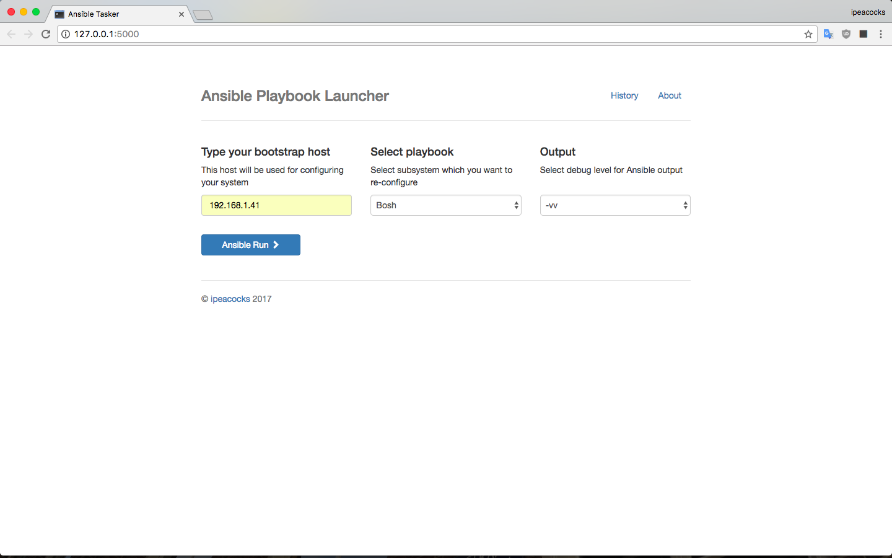
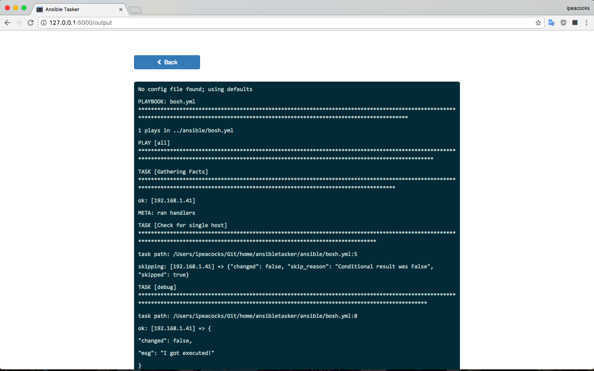
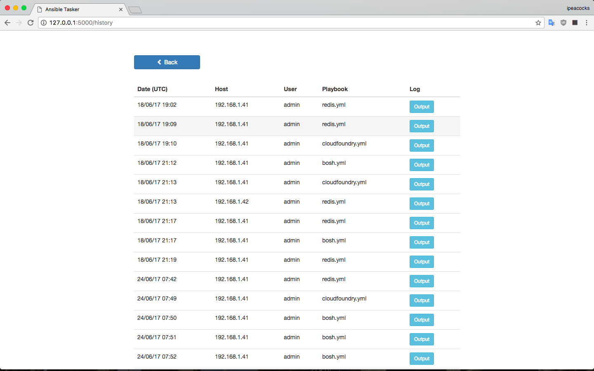
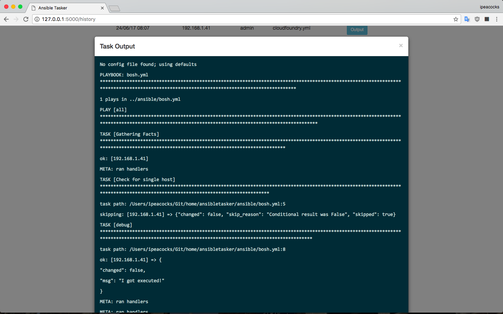

# Ansible Tasker

<p><a href="https://github.com/ansible">Ansible</a> is a radically simple IT automation system. It handles configuration-management, application deployment, cloud provisioning, ad-hoc task-execution, and multinode orchestration - including trivializing things like zero downtime rolling updates with load balancers.</p>
<p>And this is extremely simple web-admin panel for it designed for launching playbooks from browser. As example it configured for setup BOSH/Cloud Foundry/Redis. Feel free to post suggestions/bugs.</p>
<p>Project page <a href="https://github.com/ipeacocks/ansibletasker">on Github</a></p>






## Requirements

This frontend is written on:

* Python Flask Framework
* Bootstrap 3
* SQLAlchemy

## Installation

Simply create virtualenv:

```
# virtualenv --python=/usr/local/bin/python3 ansibletasker
```

Clone code:

```
# git clone git@github.com:ipeacocks/ansibletasker.git ansibletasker
```

Activate virtual env:

```
# source ansibletasker/bin/activate
```

That's almost it. Use `requirments.txt` to setup all python dependencies:

```
# cd ansibletasker
# pip install -r requirements.txt
```

Create bare sqlite db:

```
# cd project
# python db_create.py
```


