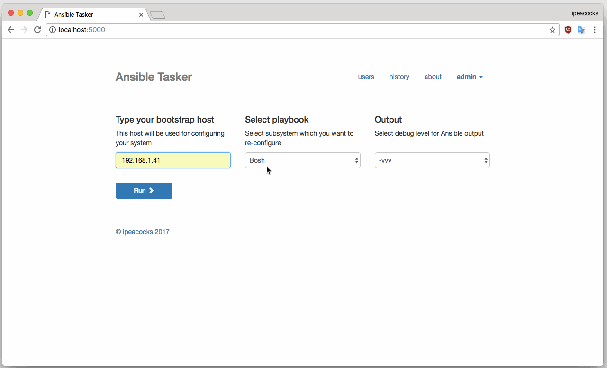

# Ansible Tasker

<p><a href="https://github.com/ansible">Ansible</a> is a radically simple IT automation system. It handles configuration-management, application deployment, cloud provisioning, ad-hoc task-execution, and multinode orchestration - including trivializing things like zero downtime rolling updates with load balancers.</p>
<p>And this is extremely simple web-admin panel for it designed for launching playbooks from browser. As example it configured for setup BOSH/Cloud Foundry/Redis. Feel free to post suggestions/bugs.</p>
<p>Project page <a href="https://github.com/ipeacocks/ansibletasker">on Github</a></p>

## Demo

<p align="center">
  
</p>

## Requirements

This frontend is written on:

* Python 3
* Flask Framework
* SQLAlchemy
* WTForms
* Bootstrap 3
* SQLite


## Installation

Simply create virtualenv:
```
# virtualenv --python=/usr/local/bin/python3 --no-site-packages ansibletasker
```
Clone code:
```
# git clone git@github.com:ipeacocks/ansibletasker.git ansibletasker
```
Ansible needs `id_rsa` private key for authorization to remote host, so copy it to `ansible` dir:
```
# cp ~/.ssh/id_rsa ansibletasker/ansible
```
Activate virtual env:
```
# source ansibletasker/bin/activate
```
That's almost it. Use `requirments.txt` to setup all python dependencies:
```
# cd ansibletasker
# pip install -r project/requirements.txt
```
Create sqlite db:
```
# python project/db_create.py
```
And finally launch:
```
# python project/run.py
```
Then you can login using link http://localhost:5000 and `admin:admin` creds.

### Docker

Pull image from Docker Hub:
```
# docker pull ipeacocks/ansibletasker
```
And simply run it:
```
# docker run -d -p 5000:5000 ansibletasker
```
Thats all, only copying private key remains:
```
# docker cp ~/.ssh/id_rsa container_id:/usr/src/app/ansible
```
That's it. Login using link http://localhost:5000 and `admin:admin` creds.
